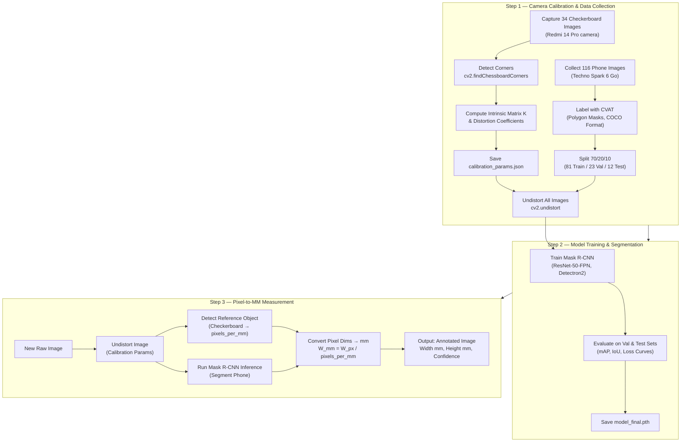

# Phone Segmentation & Metric Measurement Pipeline

## Project Overview

End-to-end computer vision pipeline that segments a **Techno Spark 6 Go** smartphone and computes its real-world dimensions (width & height in mm) from calibrated camera images.

### Key Capabilities
- **Camera Calibration**: Intrinsic calibration using checkerboard pattern to remove lens distortion
- **Instance Segmentation**: Mask R-CNN (Detectron2) trained on a custom-collected & labelled phone dataset
- **Metric Measurement**: Pixel-to-mm conversion using calibrated reference objects for accurate physical measurements

---

## System Architecture (End-to-End Pipeline)



---

## Quick Start

### Prerequisites
- Python 3.10+
- NVIDIA GPU with CUDA support (tested on GTX 1660 Super)

### Installation
```bash
# Clone the repository
git clone https://github.com/Qamar2001/Computer-Vision-Project-Image-Segmentation-Metric-Measurement.git
cd Computer-Vision-Project-Image-Segmentation-Metric-Measurement

# Create virtual environment
python -m venv venv
venv\Scripts\activate   # Windows

# Install dependencies
pip install -r requirements.txt
```

### Usage
```bash
# 1. Run camera calibration
python calibration/calibrate_camera.py

# 2. Train segmentation model
python models/train.py

# 3. Run inference on a new image
python inference/infer.py --input <image_path>

# 4. Measure object dimensions
python measurement/demo.py --input <image_path>
```

---

## Repository Structure

```
project-root/
├── calibration/           # Calibration images + scripts
├── dataset/               # Labelled dataset (train/val/test splits)
├── models/                # Training configs + saved weights
├── inference/             # Inference scripts + demo outputs
├── measurement/           # Pixel-to-mm pipeline + accuracy report
├── docs/                  # All documentation files
├── requirements.txt       # Python dependencies
├── Dockerfile             # Docker image for reproducibility
└── README.md              # This file
```

## Documentation

- [Calibration Report](docs/CALIBRATION_REPORT.md) — Camera calibration method, parameters, reprojection error
- [Dataset Card](docs/DATASET_CARD.md) — Object details, collection strategy, labelling tool, statistics
- [Training Report](docs/TRAINING_REPORT.md) — Model architecture, hyperparameters, performance metrics
- [Measurement Report](docs/MEASUREMENT_REPORT.md) — Pixel-to-mm methodology, accuracy analysis
- [Setup Guide](docs/SETUP.md) — Full installation and environment setup instructions

---

## Object of Choice

**Techno Spark 6 Go** smartphone  
- Dimensions: ~165.6 × 76.3 × 9.1 mm (manufacturer specs)
- With protective case: ~168.6 × 78.8 mm
- Justification: Readily available, consistent geometry, clear edges for segmentation, flat surfaces ideal for metric measurement

## Technology Stack

| Component | Tool |
|-----------|------|
| Camera Used | Redmi 14 Pro |
| Camera Calibration | OpenCV |
| Segmentation Model | Mask R-CNN (Detectron2) |
| Dataset Labelling | CVAT (manual polygon annotations) |
| Annotation Format | COCO JSON |
| Training Framework | PyTorch + Detectron2 |
| Language | Python 3.10 |

---

## Design Decisions & Trade-offs

1. **Mask R-CNN over YOLO**: Mask R-CNN provides per-pixel instance segmentation masks, which are essential for contour-based metric measurement. YOLO primarily provides bounding boxes (and was excluded by the task constraints).
2. **Detectron2 Framework**: Meta's research-grade library offers robust COCO integration, transfer learning from pretrained models, and battle-tested evaluation tools.
3. **Transfer Learning**: With only 116 images, training from scratch would overfit. Fine-tuning COCO-pretrained weights allows the model to leverage features learned from millions of images.
4. **Oriented Bounding Box**: Using `cv2.minAreaRect()` on the segmentation mask provides rotation-invariant width/height measurements, more accurate than axis-aligned boxes.

## Author
XIS AI Assessment Candidate
