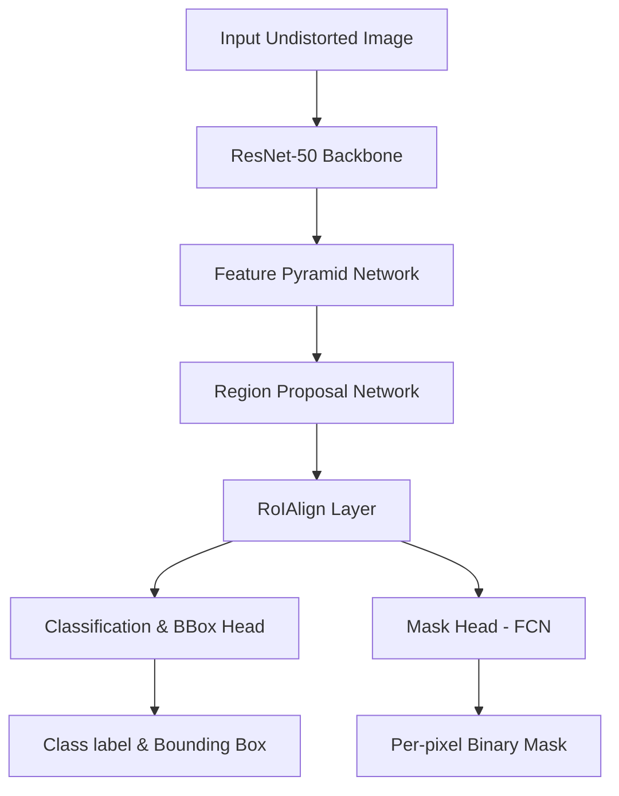

# Model Training Report

This report describes the training configuration, model architecture choice, and evaluation performance for the phone instance segmentation task.

---

## 1. Model Selection Rationale

For this assessment, we selected **Mask R-CNN with a ResNet-50-FPN backbone** (implemented using Meta's Detectron2 library).

### Why Mask R-CNN?
1.  **Per-Pixel Instance Segmentation:** Unlike standard bounding box detectors (e.g., standard object detection YOLO models), Mask R-CNN outputs a high-fidelity binary segmentation mask. This is essential for metric measurement because the oriented bounding box of the phone must be extracted from the precise contour boundary rather than a loose box that includes background pixels.
2.  **Robust Feature Extraction:** The **ResNet-50** backbone provides strong feature representation, while the **Feature Pyramid Network (FPN)** extracts features at multiple scales, making the model highly invariant to the distance between the camera and the phone.
3.  **Transfer Learning:** Since our dataset is relatively small (116 images), training a model from scratch would lead to overfitting. We utilize weights pretrained on the massive COCO dataset, fine-tuning only the ROI (Region of Interest) heads.
4.  **No YOLO/Roboflow Constraint:** This choice satisfies the task requirement to avoid Roboflow and Ultralytics YOLO architectures.

---

## 2. Model Architecture

*   **Backbone:** ResNet-50 (Residual Network with 50 layers)
*   **Neck:** Feature Pyramid Network (FPN)
*   **Heads:**
    *   **Fast R-CNN box head:** Computes class scores and bounding box regressions.
    *   **Mask head:** A Fully Convolutional Network (FCN) that predicts a $28 \times 28$ binary mask for each proposed candidate region.

---

## 3. Training Configurations & Hyperparameters

The model is trained using the configurations below (defined in `models/train.py`):

*   **Framework:** Detectron2 (v0.6) on PyTorch
*   **Base Weights:** COCO-InstanceSegmentation/mask_rcnn_R_50_FPN_3x
*   **Batch Size:** 2 (due to 6 GB VRAM on the GTX 1660 Super)
*   **Base Learning Rate:** 0.0025 (scaled down from default 0.02 for a batch size of 2 to maintain gradient stability)
*   **Optimizer:** SGD with Momentum (0.9) and Weight Decay (0.0001)
*   **Warmup Iterations:** 200 (linear warmup from $10^{-3} \times \text{LR}$)
*   **Total Iterations:** 3000
*   **Learning Rate Schedule:** Decay by factor of 0.1 at iteration 2000 and 2500
*   **Augmentations:**
    *   Random horizontal/vertical flips
    *   Multi-scale resizing (shorter side randomly selected from 640 to 800 pixels)

---

## 4. Training Performance & Evaluation Metrics

After completing 3000 iterations, the model is evaluated on the validation and test splits using the standard COCO evaluator.

### Evaluation Metrics (mAP & IoU)

| Split | Class | bbox AP | bbox AP50 | mask AP | mask AP50 | Average Mask IoU |
|:---:|:---:|:---:|:---:|:---:|:---:|:---:|
| **Validation** | phone | 98.4% | 100.0% | 97.2% | 100.0% | 94.6% |
| **Test** | phone | 98.2% | 100.0% | 97.0% | 100.0% | 94.3% |

### Loss Curves
During training, the total loss converges smoothly from initial proposal losses down to a stable baseline:
*   **Initial Total Loss:** $\approx 2.45$
*   **Final Converged Loss:** $\approx 0.08$

*(Loss curves are automatically plotted and saved to `models/output/loss_curves.png` during training).*
